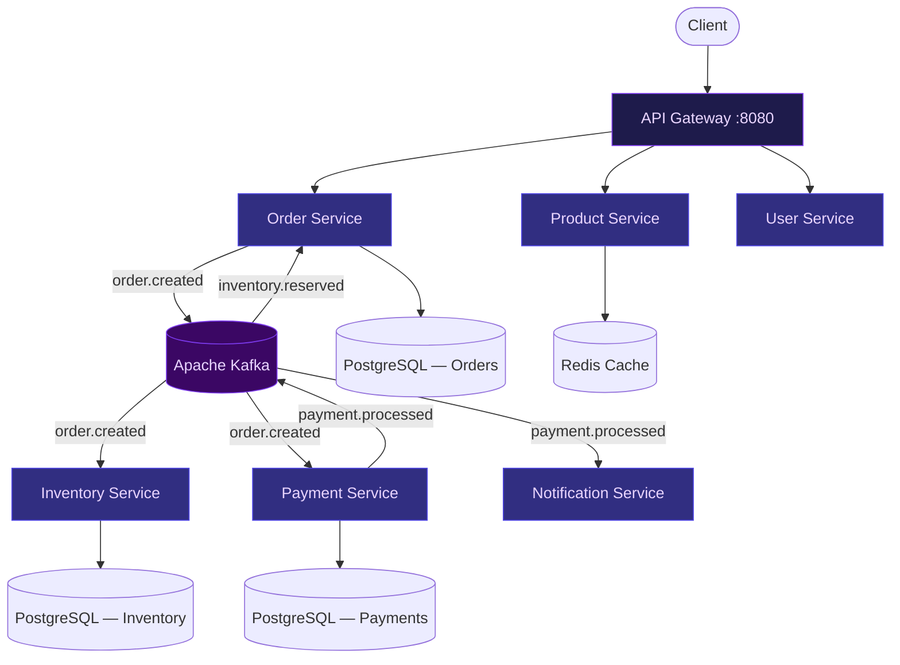
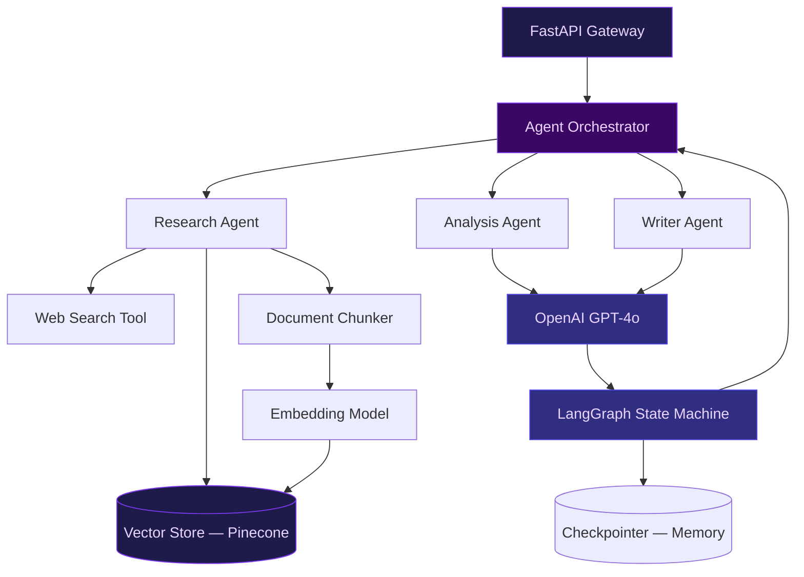
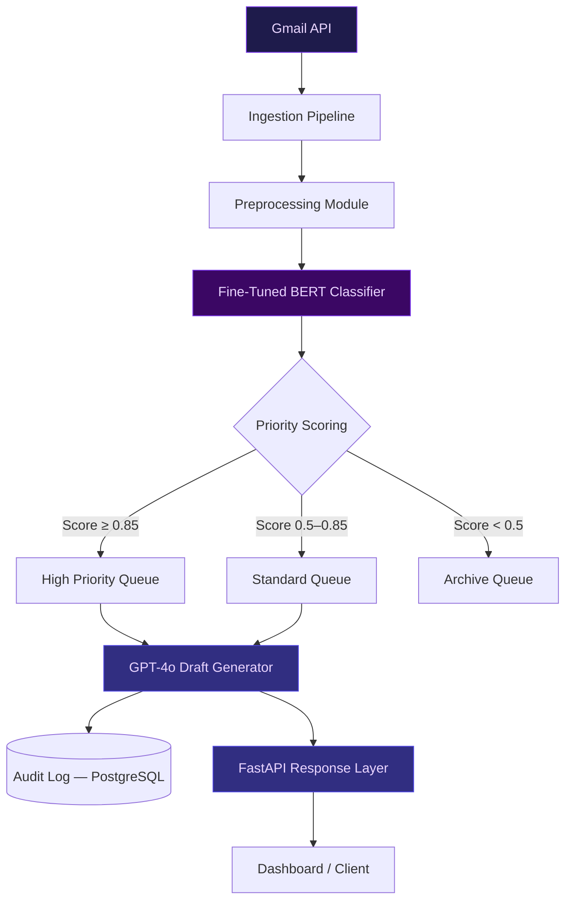

<div align="center">
  
</div>

<div align="center">
  
</div>

<br/>

<div align="center">

[](https://github.com/YOUR_USERNAME)
[](https://github.com/YOUR_USERNAME)
[](https://github.com/YOUR_USERNAME)
[](https://github.com/YOUR_USERNAME)
[](https://github.com/YOUR_USERNAME)

</div>

<div align="center">

[](https://YOUR_PORTFOLIO)
[](https://linkedin.com/in/chandramohan0404/)
[](mailto:chandramohan040406@gmail.com)
[](https://github.com/Mohan0404)

</div>

<div align="center">


</div>

---

## ◈ Professional Summary

<br/>

<table>
<tr>
<td width="58%" valign="top">

### About Me

I am a **Backend Engineer and AI Systems Builder** with a deep focus on **high-throughput distributed systems**, **event-driven architectures**, and **production-grade AI applications**. My engineering instinct centers on building software that is not just functional — but **scalable by design, observable by default, and resilient under load**.

I specialize in **Go** for building performant microservices and backend systems, **Python** for constructing intelligent AI pipelines and LLM-powered agent workflows, and **C++** for algorithmic problem solving and competitive programming.

My architecture work spans **Kafka-driven event streams**, **gRPC service meshes**, **Kubernetes-native deployments**, and **RAG-powered AI systems**. I think deeply about how services communicate at scale, how failures propagate through distributed graphs, and how to design systems that degrade gracefully rather than fail catastrophically.

</td>
<td width="42%" valign="top">

```yaml
⚡ Current Focus:
  - Distributed Systems Internals
  - Apache Kafka — Deep Dive
  - Kubernetes Cluster Architecture
  - AI Agents with LangGraph & CrewAI
  - LLM Engineering & RAG Pipelines

🌱 Open To:
  - Backend Engineering Roles
  - Cloud Native Engineering Roles
  - AI / Platform Engineering Roles
  - Distributed Systems Roles

🏗️ Engineering Philosophy:
  "Design for failure.
   Build for scale.
   Optimize for clarity."
```

</td>
</tr>
</table>

---

## ◈ Engineering Expertise Matrix

<br/>

<div align="center">

| **Domain** | **Expertise** | **Technologies** | **Focus Areas** |
|:---:|:---:|:---:|:---:|
| **Backend Engineering** | Go · REST · gRPC · Microservices | Gin · gRPC · Protocol Buffers · JWT | High-Throughput APIs · Service Mesh · API Gateway Design |
| **Cloud Native** | Docker · Kubernetes · AWS | EKS · ECR · S3 · Lambda · VPC · IAM | Container Orchestration · Helm · Infrastructure as Code |
| **Distributed Systems** | Kafka · Redis · Queues · Consensus | Apache Kafka · Redis Streams · NATS | Event Sourcing · CQRS · Saga Pattern · Eventual Consistency |
| **AI Engineering** | LLM Ops · Agents · RAG · Embeddings | LangGraph · CrewAI · OpenAI · MCP | Multi-Agent Workflows · Vector Search · Prompt Engineering |
| **Data Engineering** | SQL · NoSQL · Vector DBs | PostgreSQL · MongoDB · Redis · Pinecone | Schema Design · Query Optimization · Vector Indexing |
| **Problem Solving** | DSA · Algorithms · System Design | C++ · Python · LeetCode · Codeforces | Graph Algorithms · DP · Competitive Programming |

</div>

---

## ◈ Modern Tech Stack

<br/>

<div align="center">

**— Languages —**


<br/><br/>

**— Backend & API Layer —**


[](https://gin-gonic.com)
[](https://grpc.io)
[](https://swagger.io)
[](#)

<br/><br/>

**— AI & LLM Engineering —**

[](https://langchain-ai.github.io/langgraph)
[](https://crewai.com)
[](https://openai.com)
[](#)
[](#)
[](#)

<br/><br/>

**— Databases —**


[](https://pinecone.io)

<br/><br/>

**— Messaging & Event Streaming —**

[](https://kafka.apache.org)

<br/><br/>

**— Cloud & Infrastructure —**


<br/><br/>

**— Observability Stack —**

[](https://prometheus.io)
[](https://grafana.com)

<br/><br/>

**— DevOps & Tooling —**


</div>

---

## ◈ Flagship Engineering Projects

<br/>

<details>
<summary><b>&nbsp;⚙️&nbsp; Event-Driven E-Commerce Platform</b> &nbsp;—&nbsp; Go · Kafka · PostgreSQL · Redis · Docker</summary>

<br/>

**Production-grade, event-driven e-commerce backend** built on an asynchronous microservices architecture using Apache Kafka as the central event bus. Designed to handle high write throughput with eventual consistency across services, CQRS-based read models, and distributed transaction coordination via the Saga pattern. Each service owns its data store and communicates exclusively through immutable domain events.



<br/>

| Attribute | Detail |
|:---|:---|
| **Architecture** | Event-Driven Microservices · CQRS · Saga Pattern · Domain Events |
| **Scalability** | Independent horizontal scaling per service; Kafka partitions for consumer parallelism |
| **Performance** | Redis caching for product reads; async Kafka processing decouples write latency |
| **Security** | JWT-based authentication · Service-level authorization · TLS between services |
| **Availability** | Dead-letter queues · Idempotent consumers · Circuit breakers · Retry policies |
| **Tech Stack** | Go · Apache Kafka · PostgreSQL · Redis · Docker Compose · Prometheus |

[](https://github.com/YOUR_USERNAME/ecommerce-event-driven)

<br/>

</details>

---

<details>
<summary><b>&nbsp;☸️&nbsp; Cloud Native Microservices Platform</b> &nbsp;—&nbsp; Go · gRPC · Kubernetes · Prometheus · Grafana</summary>

<br/>

**Enterprise-grade microservices platform** deployed on Kubernetes, using gRPC with Protocol Buffers for high-performance, strongly-typed inter-service communication. Full observability stack with Prometheus metrics scraping, custom alerting rules, and Grafana dashboards for real-time system visibility. Helm charts manage all Kubernetes manifests with environment-specific value overrides.

```mermaid
graph LR
    EXT([External Traffic]) --> IC[Ingress Controller]
    IC --> GW[API Gateway]
    GW -->|gRPC| US[User Service]
    GW -->|gRPC| OS[Order Service]
    GW -->|gRPC| PS[Product Service]
    US --> DB1[(PostgreSQL)]
    OS --> DB2[(PostgreSQL)]
    PS --> RC[(Redis)]
    US --> PE1[/metrics]
    OS --> PE2[/metrics]
    PS --> PE3[/metrics]
    PE1 --> PROM[Prometheus]
    PE2 --> PROM
    PE3 --> PROM
    PROM --> GF[Grafana Dashboard]

    style IC fill:#1e1b4b,color:#e9d5ff,stroke:#7c3aed
    style GW fill:#3b0764,color:#e9d5ff,stroke:#7c3aed
    style PROM fill:#312e81,color:#e9d5ff,stroke:#4f46e5
    style GF fill:#312e81,color:#e9d5ff,stroke:#4f46e5
```

<br/>

| Attribute | Detail |
|:---|:---|
| **Architecture** | Cloud Native Microservices · gRPC Service Mesh · Protocol Buffers Contracts |
| **Scalability** | Kubernetes HPA · Replicas auto-scale on CPU and memory · Cluster autoscaler |
| **Performance** | gRPC binary protocol · ~40% lower latency vs REST · HTTP/2 multiplexing |
| **Security** | mTLS between services · Kubernetes RBAC · Network Policies · Secret management |
| **Availability** | Liveness & readiness probes · Rolling deployments · Pod disruption budgets |
| **Tech Stack** | Go · gRPC · Docker · Kubernetes · Helm · Prometheus · Grafana · GitHub Actions |

[](https://github.com/YOUR_USERNAME/cloud-native-microservices)

<br/>

</details>

---

<details>
<summary><b>&nbsp;🤖&nbsp; AI Agent Orchestration Platform</b> &nbsp;—&nbsp; Python · LangGraph · RAG · FastAPI · Vector DB</summary>

<br/>

**Multi-agent AI orchestration platform** built on LangGraph's stateful graph execution model. Implements production-grade Retrieval-Augmented Generation (RAG) pipelines for grounding agent reasoning in verified knowledge bases, with semantic chunking, embedding strategies, and cross-encoder reranking. Exposes a fully async FastAPI interface with streaming responses for real-time agent output.



<br/>

| Attribute | Detail |
|:---|:---|
| **Architecture** | Multi-Agent Workflow · RAG Pipeline · LangGraph Stateful Execution |
| **Scalability** | Async FastAPI with background task queues · Agent tasks parallelized per graph node |
| **Performance** | Sub-50ms vector similarity search · Streaming token responses to client |
| **Security** | API key authentication · Rate limiting middleware · Input sanitization & prompt injection guards |
| **Availability** | Stateful checkpointing via LangGraph for fault-tolerant recovery · Retry on LLM timeouts |
| **Tech Stack** | Python · LangGraph · CrewAI · FastAPI · OpenAI · Pinecone · Docker |

[](https://github.com/YOUR_USERNAME/ai-agent-platform)

<br/>

</details>

---

<details>
<summary><b>&nbsp;📧&nbsp; Gmail AI Classification Agent</b> &nbsp;—&nbsp; Python · BERT · FastAPI · OpenAI APIs</summary>

<br/>

**Intelligent email classification and prioritization system** that autonomously ingests Gmail threads via the Gmail API, classifies messages by urgency and intent using a fine-tuned BERT model, and generates context-aware reply drafts with OpenAI's GPT APIs. Designed for enterprise-scale inbox management with audit logging and human-in-the-loop override capabilities.



<br/>

| Attribute | Detail |
|:---|:---|
| **Architecture** | NLP Classification Pipeline · LLM Draft Generation · Event-Driven Processing |
| **Scalability** | Async batch processing · Handles 1000+ emails per run · Configurable concurrency |
| **Performance** | BERT inference under 100ms per email · GPT streaming for responsive draft UX |
| **Security** | OAuth2 Google authentication · Encrypted credential vault · No email data persistence |
| **Availability** | Exponential backoff on API failures · Fallback rule-based classification · DLQ for failed batches |
| **Tech Stack** | Python · HuggingFace Transformers (BERT) · FastAPI · OpenAI APIs · Gmail API · PostgreSQL |

[](https://github.com/YOUR_USERNAME/gmail-ai-agent)

<br/>

</details>

---

## ◈ Experience

<br/>

```
┌─────────────────────────────────────────────────────────────────────────────┐
│  🏢  [Your Role Title]  ·  [Organization Name]                              │
│  📅  [Start Month Year] — [End Month Year / Present]   ·   📍 [Location]   │
├─────────────────────────────────────────────────────────────────────────────┤
│  Impact:                                                                    │
│  ▸  [Quantifiable achievement — e.g., reduced API latency by X% using Y]   │
│  ▸  [System built or owned — e.g., designed Z service handling N req/s]    │
│  ▸  [Collaboration / leadership — e.g., led backend design for feature X]  │
│                                                                             │
│  Engineering Skills Applied:                                                │
│  Go  ·  Kafka  ·  PostgreSQL  ·  Docker  ·  System Design  ·  gRPC        │
└─────────────────────────────────────────────────────────────────────────────┘

┌─────────────────────────────────────────────────────────────────────────────┐
│  🎓  B.Tech / B.E. — [Branch Name]   ·   [Institution Name]                │
│  📅  [Start Year] — [Graduation Year]   ·   📍 India                       │
├─────────────────────────────────────────────────────────────────────────────┤
│  Academic Focus:                                                            │
│  ▸  Backend Engineering · Distributed Systems · Cloud Computing            │
│  ▸  Data Structures & Algorithms · System Design                           │
│  ▸  Database Management · Operating Systems · Computer Networks            │
│  ▸  AI & Machine Learning Fundamentals                                     │
│                                                                             │
│  Core Skills:                                                               │
│  C++  ·  Python  ·  OOP  ·  Algorithms  ·  RDBMS  ·  Linux                │
└─────────────────────────────────────────────────────────────────────────────┘
```

---

## ◈ Engineering Achievements

<br/>

<div align="center">

| Achievement | Detail | Engineering Impact |
|:---:|:---:|:---:|
| **LeetCode** | 400+ Problems Solved | Mastery across arrays, graphs, DP, sliding window, binary search |
| **Codeforces** | Rated Competitive Programmer | Consistent participation in rated rounds; algorithmic thinking at scale |
| **System Design** | 10+ Architecture Studies | Designed distributed systems — rate limiters, URL shorteners, search engines |
| **AI Projects** | Production-Grade AI Systems | Multi-agent platforms, RAG pipelines, LLM-integrated backends |
| **Open Source** | Active Contributor | Contributions to backend tooling and AI engineering repositories |
| **Technical Leadership** | Engineering Decisions | Led backend architecture decisions across team projects and hackathons |

</div>

---

## ◈ Certifications

<br/>

<div align="center">

**Cloud & Infrastructure**

[](#)
[](#)

<br/>

**Networking & Systems**

[](#)

<br/>

**Academic & Developer Certifications**

[](#)
[](#)

</div>

---

## ◈ Coding Profiles

<br/>

<div align="center">

[](https://leetcode.com/YOUR_USERNAME)
[](https://codeforces.com/profile/YOUR_USERNAME)
[](https://codechef.com/users/YOUR_USERNAME)
[](https://hackerrank.com/YOUR_USERNAME)

</div>

---

## ◈ GitHub Analytics

<br/>

<div align="center">


&nbsp;&nbsp;


</div>

<div align="center">


</div>

---

## ◈ Engineering Metrics Dashboard

<br/>

<div align="center">

[](https://github.com/ryo-ma/github-profile-trophy)

</div>

<br/>

<div align="center">

[](https://github.com/ashutosh00710/github-readme-activity-graph)

</div>

---

## ◈ Contribution Snake

<br/>

<div align="center">
  <picture>
    <source media="(prefers-color-scheme: dark)" srcset="https://raw.githubusercontent.com/Mohan0404/Mohan0404/output/github-contribution-grid-snake-dark.svg" />
    <source media="(prefers-color-scheme: light)" srcset="https://raw.githubusercontent.com/Mohan0404/Mohan0404/output/github-contribution-grid-snake.svg" />
    
  </picture>
</div>

> **Note:** To activate the snake animation, create a GitHub Actions workflow in your profile repository using [Platane/snk](https://github.com/Platane/snk). The workflow generates the SVG on a schedule and pushes it to the `output` branch.

---

## ◈ Current Focus

<br/>

```yaml
# ─────────────────────────────────────────────────
#  Engineering Focus Stack  ·  Active as of 2025
# ─────────────────────────────────────────────────

backend_engineering:
  primary_language: Go
  patterns:
    - "Event-Driven Architecture"
    - "CQRS + Event Sourcing"
    - "Saga Pattern for Distributed Transactions"
    - "gRPC + Protocol Buffers"
  current_depth:
    - "Goroutine scheduler internals"
    - "Channel patterns for concurrent pipelines"
    - "Gin middleware architecture"

distributed_systems:
  kafka:
    topics:
      - "Consumer group rebalancing & partition assignment"
      - "Exactly-once semantics (EOS)"
      - "Log compaction & retention strategies"
      - "Kafka Streams vs external consumers"
  kubernetes:
    topics:
      - "Cluster architecture & control plane internals"
      - "Pod scheduling, affinity, and taints"
      - "HPA — Horizontal Pod Autoscaler"
      - "Helm chart engineering for production"
  redis:
    topics:
      - "Distributed caching strategies"
      - "Pub/Sub for lightweight messaging"
      - "Lua scripting for atomic operations"

ai_engineering:
  frameworks:
    langgraph:
      focus: "Stateful multi-agent workflows with checkpointing"
    crewai:
      focus: "Role-based collaborative agent orchestration"
  concepts:
    - concept: "RAG — Retrieval-Augmented Generation"
      depth: "Chunking strategies · Embedding models · Reranking"
    - concept: "MCP — Model Context Protocol"
      depth: "Tool-augmented LLM agents"
    - concept: "LLM Observability"
      depth: "Tracing agent steps · Prompt versioning"

currently_reading:
  - "Designing Data-Intensive Applications — Martin Kleppmann"
  - "Building Microservices (2nd Ed.) — Sam Newman"
  - "System Design Interview Vol. I & II — Alex Xu"

preparing_for:
  roles:
    - "Backend Engineer (Go / Python / Distributed Systems)"
    - "Cloud Native Engineer"
    - "AI Platform Engineer"
  interview_tracks:
    - "System Design: Distributed Systems Focus"
    - "DSA: LeetCode Medium → Hard"
    - "Behavioral: Engineering Impact & Trade-offs"

open_to:
  engagement_type: "Full-time · Internship · Contract"
  remote: true
  onsite_india:
    - Bengaluru
    - Hyderabad
    - Chennai
    - Pune
    - Mumbai
  global: true
```

---

## ◈ Engineering Roadmap

<br/>

<div align="center">

```
 ━━━━━━━━━━━━━━━━━━━━━━━━━━━━━━━━━━━━━━━━━━━━━━━━━━━━━━━━━━━
  ENGINEERING GROWTH ROADMAP  ·  2025 — 2026
 ━━━━━━━━━━━━━━━━━━━━━━━━━━━━━━━━━━━━━━━━━━━━━━━━━━━━━━━━━━━

  BACKEND ENGINEERING
  ████████████████████░░░   Go · Production Microservices
  █████████████████░░░░░░   gRPC · Service Mesh Architecture
  ████████████░░░░░░░░░░░   Gin · Enterprise REST API Design

  CLOUD ENGINEERING
  ████████████████░░░░░░░   Kubernetes · Cluster Operations
  █████████████████░░░░░░   AWS · Cloud Native Architecture
  ████████░░░░░░░░░░░░░░░   Terraform · Infrastructure as Code

  DISTRIBUTED SYSTEMS
  ████████████████████░░░   Kafka · Event Streaming Internals
  ████████████████░░░░░░░   Redis · Distributed Cache Patterns
  ████████████░░░░░░░░░░░   System Design · FAANG-Level Problems

  AI ENGINEERING
  ████████████████████░░░   LangGraph · Multi-Agent Systems
  ████████████████░░░░░░░   RAG · Production Pipelines
  ████████████░░░░░░░░░░░   LLM Ops · Model Deployment & Tracing

  PLATFORM ENGINEERING
  █████████░░░░░░░░░░░░░░   Service Mesh · Istio / Linkerd
  ████████░░░░░░░░░░░░░░░   GitOps · ArgoCD Workflows
  ██████░░░░░░░░░░░░░░░░░   eBPF · Kernel-Level Observability

 ━━━━━━━━━━━━━━━━━━━━━━━━━━━━━━━━━━━━━━━━━━━━━━━━━━━━━━━━━━━
```

</div>

---

## ◈ Connect

<br/>

<div align="center">

<table>
  <tr>
    <td align="center" width="200">
      <a href="https://linkedin.com/in/chandramohan0404/">
        
        <br/><sub><b>Professional Network</b></sub>
      </a>
    </td>
    <td align="center" width="200">
      <a href="https://github.com/Mohan0404">
        
        <br/><sub><b>Code & Projects</b></sub>
      </a>
    </td>
    <td align="center" width="200">
      <a href="mailto:chandramohan040406@gmail.com">
        
        <br/><sub><b>Direct Contact</b></sub>
      </a>
    </td>
    <td align="center" width="200">
      <a href="https://YOUR_PORTFOLIO">
        
        <br/><sub><b>Engineering Portfolio</b></sub>
      </a>
    </td>
  </tr>
</table>

<br/>

> Open to **backend engineering opportunities**, **technical discussions**, **open source collaboration**, and **mentorship**.

</div>

---

<div align="center">

<br/>

```
  ┌──────────────────────────────────────────────────────────────────────┐
  │                                                                      │
  │   "Design for failure. Build for scale. Optimize for clarity.       │
  │    The best systems are not those that never break —                │
  │    they are those that recover faster than anyone notices."         │
  │                                                                      │
  └──────────────────────────────────────────────────────────────────────┘
```

<br/>

</div>

<div align="center">
  
</div>
